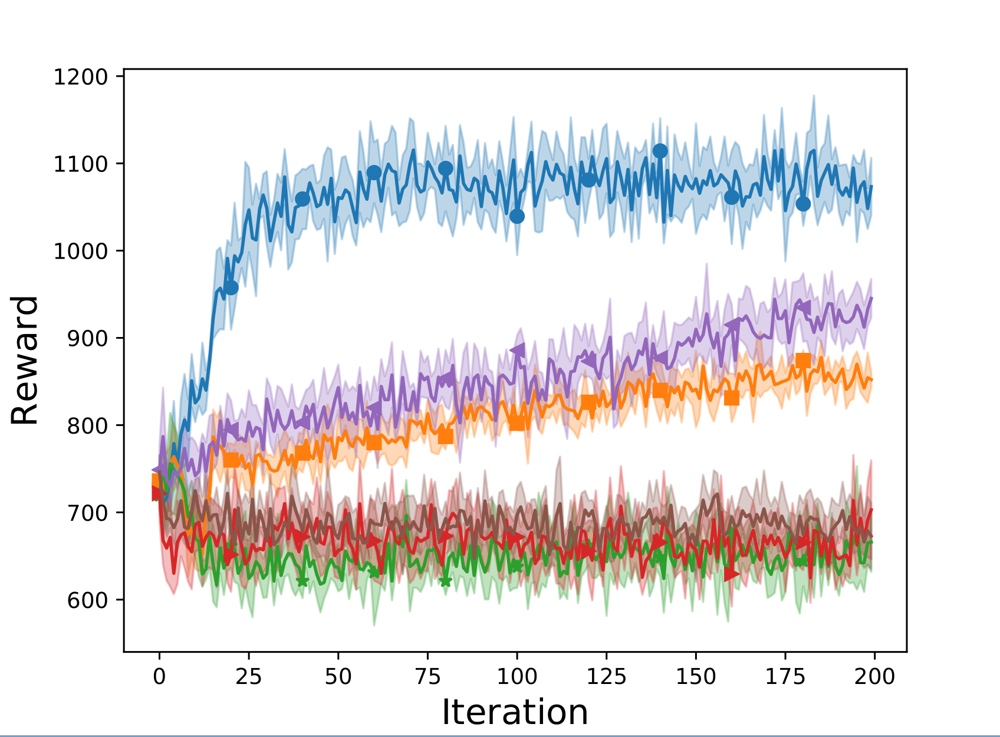
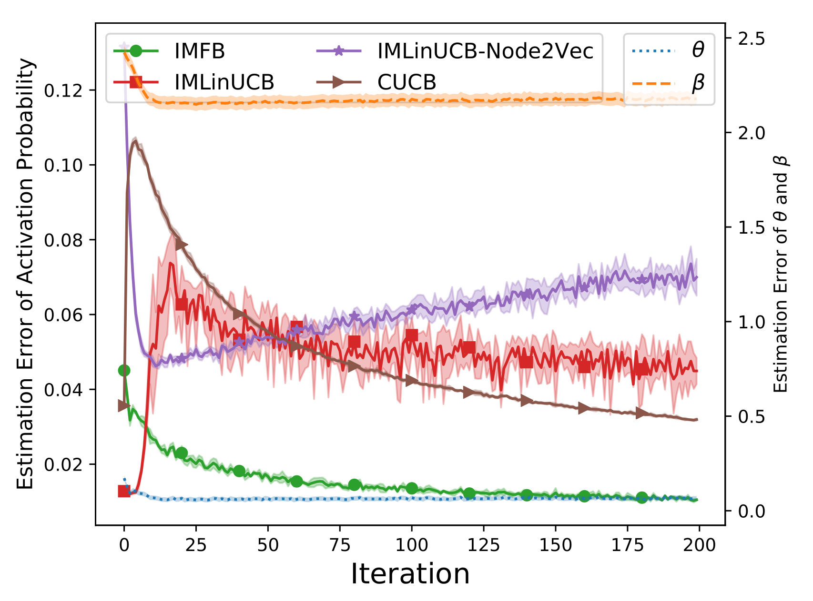
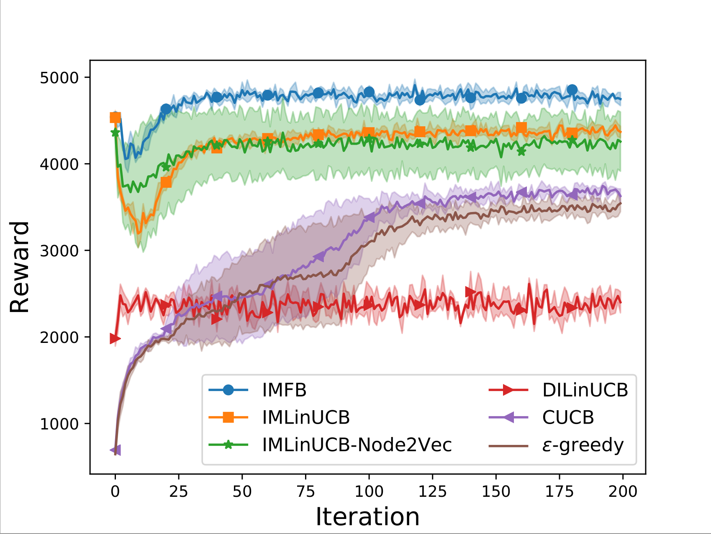
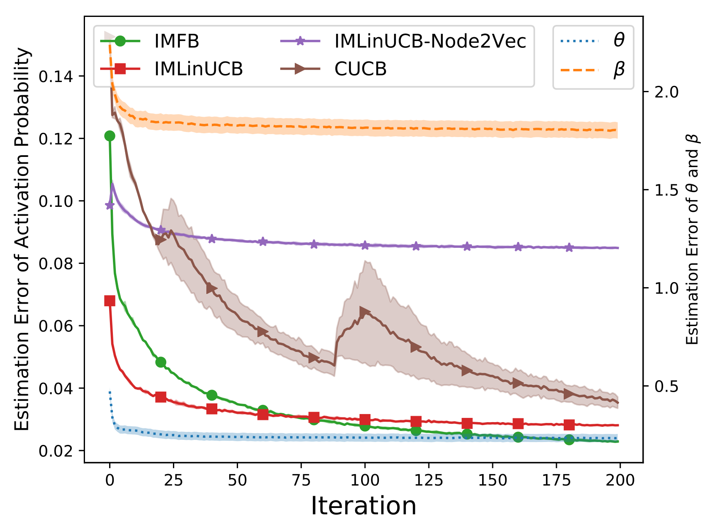

# IMBandits

IMBandit.py -- Simulator. Can run the experiments with command ```python IMBandit.py``` 

BanditAlg -- Baselines for running influence maximization problems.

Oracle/degreeDiscount.py, generalGreedy.py -- Two different oracles (IM algorithm).

IC/IC.py -- Independent cascade model, runIC() returns influence result given seed nodes.

conf.py -- The relative parameters used for the experiments. 

SimulationResults -- The folder saved for the results. 

### Result

#### Parameter

```python
graph_address = './datasets/Flickr/Small_Final_SubG.G'
prob_address = './datasets/Flickr/Probability.dic'
param_address = './datasets/Flickr/Small_nodeFeatures.dic'
edge_feature_address = './datasets/Flickr/Small_edgeFeatures.dic'
dataset = 'Flickr-Random' #Choose from 'default', 'NetHEPT', 'Flickr'

dataset = 'Flickr' #Choose from 'default', 'NetHEPT', 'Flickr'
alpha_1 = 0.1
alpha_2 = 0.1
lambda_ = 0.4
gamma = 0.1
dimension = 4
seed_size = 300
iterations = 200

oracle = degreeDiscountIAC3
```

#### Experiment
Result on Flickr dataset: 12812 nodes, 137986 edges

<p float="left">


</p>

#### Parameter

```python
graph_address = './datasets/NetHEPT/Small_Final_SubG.G'
prob_address = './datasets/NetHEPT/Probability.dic'
param_address = './datasets/NetHEPT/Small_nodeFeatures.dic'
edge_feature_address = './datasets/NetHEPT/Small_edgeFeatures.dic'
dataset = 'NetHEPT' #Choose from 'default', 'NetHEPT', 'Flickr'

dataset = 'Flickr' #Choose from 'default', 'NetHEPT', 'Flickr'
alpha_1 = 0.1
alpha_2 = 0.1
lambda_ = 0.4
gamma = 0.1
dimension = 4
seed_size = 300
iterations = 200

oracle = degreeDiscountIAC3
```


#### Experiment

Result on NetHEPT dataset: 27770 nodes, 352807 edges

<p float="left">


</p>

